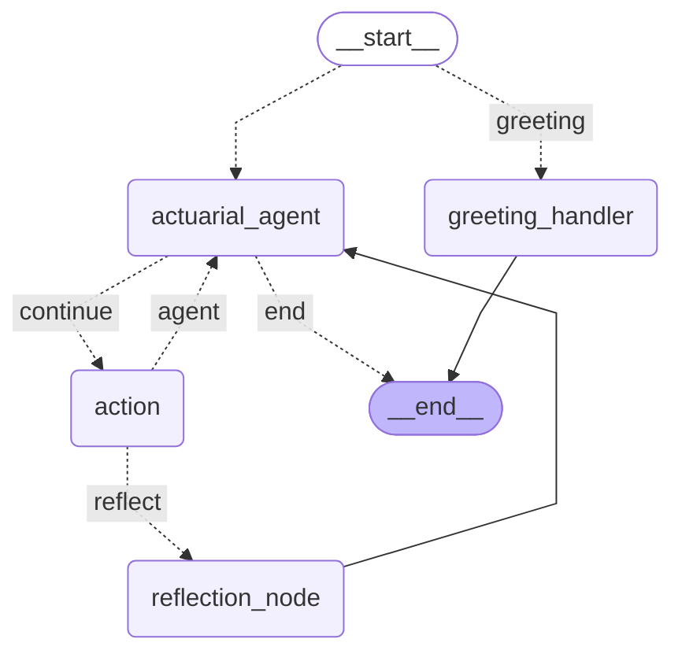

## Agent Graph Visualization



## Agent's Solutions

**Problem 1:**
`Find the price of a bond that pays half-yearly coupons of 5% of nominal value per annum, and is redeemable at par in 10 years. The effective interest rate is 6% per annum. The investor is subject to 20% income tax and 25% capital gains tax, refer to my notes to find the appropriate test for capital gains, to determine if capital gains is payable on redemption. `

**Answer 1:**
```
Here is the step-by-step solution:

### 1. Capital Gains Test

First, I will consult the course notes to determine the appropriate test for capital gains tax.

**Action:** `course_notes_retriever(query='capital gains tax on redemption of a security')`
**Result:** The notes state that a capital gain exists if:
`i(p) > (D/R) * (1 - t1)`
Where:
*   `i(p)` is the nominal interest rate.
*   `D` is the annual coupon rate (0.05).
*   `R` is the redemption value (1, since it's redeemable at par).
*   `t1` is the income tax rate (0.20).

### 2. Calculate the Nominal Interest Rate `i(2)`

The bond pays coupons half-yearly (`p=2`), so we need to find the nominal interest rate convertible half-yearly that is equivalent to an effective annual rate of 6%.

**Action:** `nominal_interest_from_effective_interest(i=0.06, p=2)`
**Result:** `i(2)` = 0.059126

### 3. Perform the Capital Gains Test

Now, we check if the condition is met:
*   `i(2)` = 0.059126
*   `(D/R) * (1 - t1)` = (0.05 / 1) * (1 - 0.20) = 0.04

Since 0.059126 > 0.04, there is a capital gain, and capital gains tax is payable on redemption.

### 4. Calculate the Price of the Bond

The price of the bond is the present value of the future cash flows (coupons and redemption payment), adjusted for taxes.

The formula for the price (P) of a bond with income and capital gains tax is:
`P = C(1 - t1) * a_n^(p) + R * v^n - t2 * (R - P) * v^n`
This can be rearranged to solve for P directly. The `price_bond_with_tax` tool implements this calculation.

**Parameters:**
*   `i` = 0.06 (Effective annual interest rate)
*   `p` = 2 (Coupons are paid half-yearly)
*   `n` = 10 (Years to maturity)
*   `C` = 0.05 (Annual coupon rate)
*   `R` = 1 (Redemption value, at par)
*   `t_1` = 0.20 (Income tax rate)
*   `t_2` = 0.25 (Capital gains tax rate)

**Action:** `price_bond_with_tax(C=0.05, R=1, i=0.06, n=10, p=2, t_1=0.2, t_2=0.25)`
**Result:** 0.833973

The price of the bond is **£83.40** (per £100 nominal).
```

**Problem 2 (Follow-up):**
`Great. You may now assume that there is no tax payable and that the security pays coupons increasing at a contstant rate of 1% per annum to perpetuity. The first coupon payment is 5% of nominal value, and coupons are now paid annually in arrears. The annual inflation rate is expected to be 3% p.a to pepertuity. Find the price of the security evaluated at the real rate of intrest, if the money rate of interest is 6% per annum.`

**Answer 2:**
```
Of course. Here is the solution:

### 1. Principle

The price of a security is the present value of its future cash flows. This value can be calculated in two equivalent ways:
1.  By discounting the **nominal** cash flows at the **nominal** (money) interest rate.
2.  By discounting the **real** cash flows at the **real** interest rate.

Both methods yield the same price. Method 1 is more direct.

### 2. Assumptions
*   The security is valued per 100 nominal.
*   The first coupon of 5% is paid at the end of the first year.

### 3. Method 1: Using Nominal Rates and Cash Flows

The stream of payments is a perpetuity where the first payment is 5 and the payments grow at 1% per annum. We can use the formula for a growing perpetuity, `P = D1 / (i - g)`, where `D1` is the first payment, `i` is the interest rate, and `g` is the growth rate.

*   **First Payment (D1):** 5% of 100 = 5
*   **Interest Rate (i):** 6% or 0.06 (the given money rate)
*   **Growth Rate (g):** 1% or 0.01

**Action:** `pv_perpetuity_from_d1(D1=5, i=0.06, g=0.01)`
**Result:** 100.0

### 4. Method 2: Using Real Rates and Cash Flows (Verification)

This method directly addresses the phrasing "evaluated at the real rate of interest" and serves as a verification.

**Step 4a: Calculate the real rate of interest (`i_prime`)**
We are given the money rate `i = 0.06` and the inflation rate `j = 0.03`.

**Action:** `real_rate_of_interest(i=0.06, j=0.03)`
**Result:** `i_prime` = 0.029126

**Step 4b: Calculate the real value of the first coupon (`D1_real`)**
The first nominal coupon of 5 is paid at time t=1. Its real value at t=0 is the nominal value discounted by one year of inflation.
`D1_real = 5 / (1 + j) = 5 / 1.03 = 4.854369`

**Step 4c: Calculate the real growth rate of the coupons (`g_prime`)**
The relationship between nominal growth (g), real growth (g'), and inflation (j) is `(1+g) = (1+g') * (1+j)`.
`g_prime = (1.01 / 1.03) - 1 = -0.019417`
This means the real value of the coupons is decreasing over time.

**Step 4d: Calculate the price**
We use the same perpetuity formula but with real values.

**Action:** `pv_perpetuity_from_d1(D1=4.854369, i=0.029126, g=-0.019417)`
**Result:** 100.0

### 5. Conclusion

Both methods produce the same result. The price of the security is **100.00**.
```